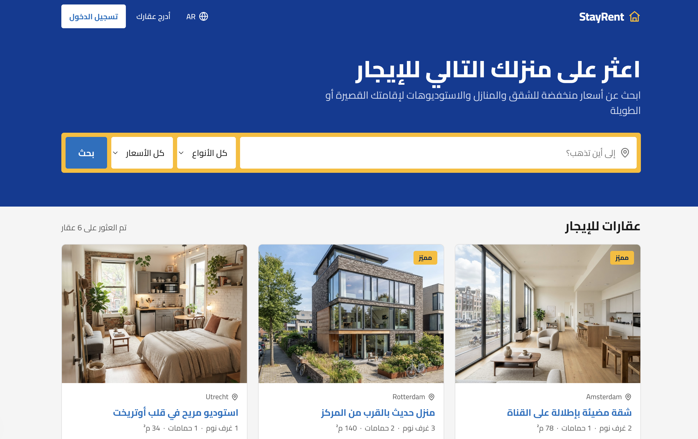

# Stay Rent


 

> [Sanity studio repo](https://github.com/zaqoutm/real-estate-portal-studio)

<br>

<div align='center' style="border:0.3px solid #ddd; border-radius:8px; padding: 12px;">
  
</div>

### Features:

- Search
- add, update, remove and listing properties
- contact form
- localization [En, NL, Ar]

<br>

# 🛠️ Tech stack

- react 19
- next 16.2.6 https://nextjs.org/docs
- sanity https://www.sanity.io
- next-intl

# 🚀 Run

```sh
npm i
npm run dev
```

Configure and connect sanity, or mock data will be used.

```sh
NEXT_PUBLIC_SANITY_PROJECT_ID=
NEXT_PUBLIC_SANITY_API_VERSION=
NEXT_PUBLIC_SANITY_DATASET=
```

<br>

<div style="text-align: center">
by Mohammed. using v0 
</div>
